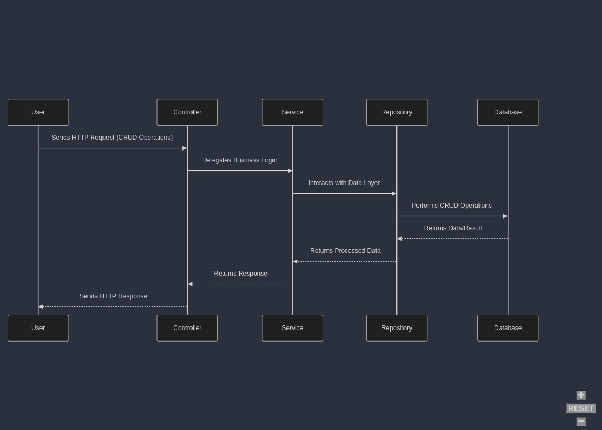

# Spring Boot CRUD Application and Weather Fetching using OpenWeatherMap

## Description
Application for performing CRUD operations on a local database and interacting with the OpenWeatherMap API.

## Objectives

* Defining controllers
* Creating services to define the logic for manipulating data entering and exiting the database
* Establishing the connection between the application and the database

## Architecture

The user sends HTTP requests to endpoints defined by controllers, services act upon the data sent in the request, and the repository handles the connection with the database.

## Functionalities/Usage Examples
This functional model can be used in implementing any web solution that requires a backend that performs CRUD operations on a database.